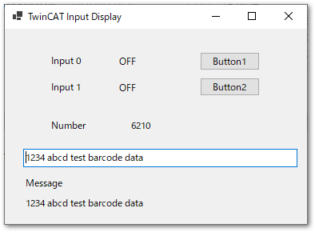

# TwinCAT ADS通信による VB.NETによるWindows Formアプリケーションサンプル

## 実装内容

次図のForm画面を通じてTwinCATの変数の値をリアルタイムに同期します。

次の動作を実現しています。

* EtherCATからのBOOL型の入力変数配列"test_input[]"の値の変化をイベントとして.NETのハンドラによりForm上の`Input0`, `Input1`にON/OFF反映させる
* TwinCAT上の周期タイマの現在値をWindows Form上の`Number`欄にリアルタイム表示する
* Form側の次の3種類の操作イベントに応じてTwinCAT側の変数に値を反映させる。
    1. Formのボタン`Button1`のマウス左ボタンを押す（Down） / 離す（Up）それぞれのイベントでTwinCATの出力変数のON/OFFに反映させてEtherCATの出力変数に反映する（モーメンタリボタン）
    2. Formのボタン`Button2`のClickイベントでBooleanメンバ変数をON/OFFをトグルで切り替え、TwinCATの出力変数へ反映する（オルタネートボタン）
    3. Formの入力ボックスの文字が変更されるイベントによって、その文字列をリアルタイムにTwinCATの文字列変数に反映し、その内容が`Message`欄のテキストに反映される。

## 実行方法

1. "VB_NET" 以下のソリューションをVisual Studio 2022で開き、ビルドした実行プログラムをIPCのWindows上に置きます。
2. "TwinCAT" 以下のソリューションをTwinCAT XAEで開き、IPCに転送してRUNモードへ移行します。必要に応じてEtherCATのI/Oとtest_input[]やtest_output[]とリンクを張ってください。
3. 1でビルドした実行プログラムをIPC上で実行し、フォームから操作した結果が変数に反映されていることを確認します。